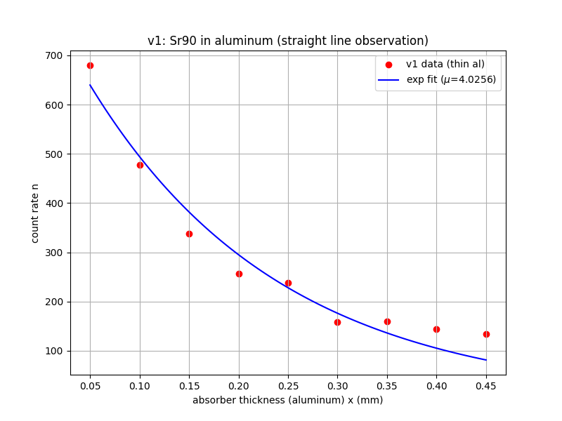
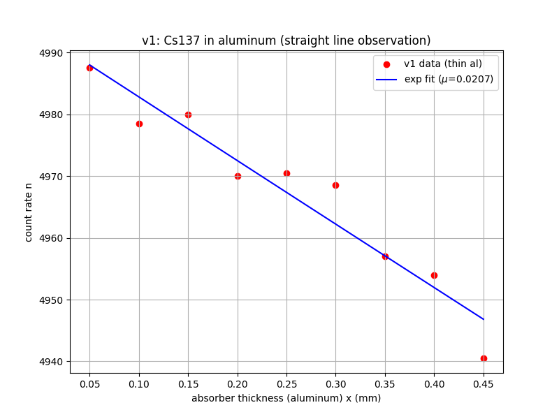
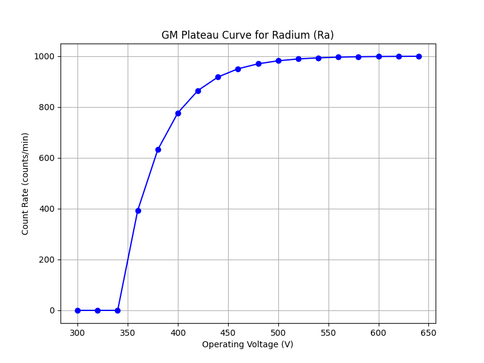
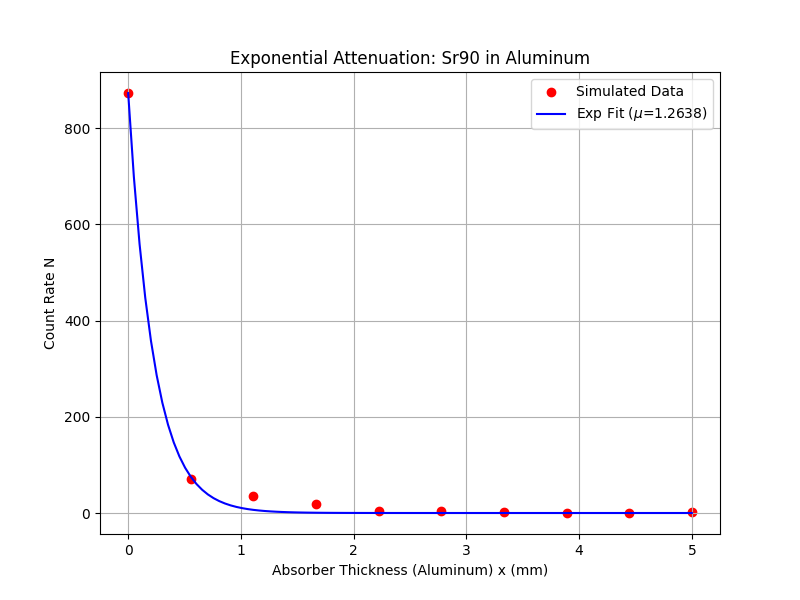
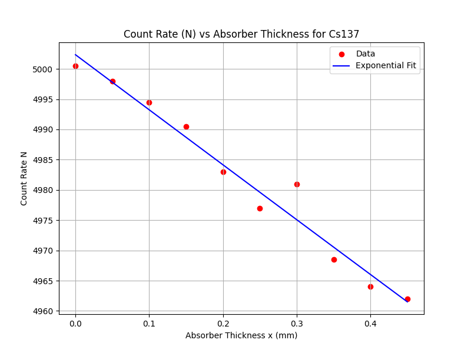
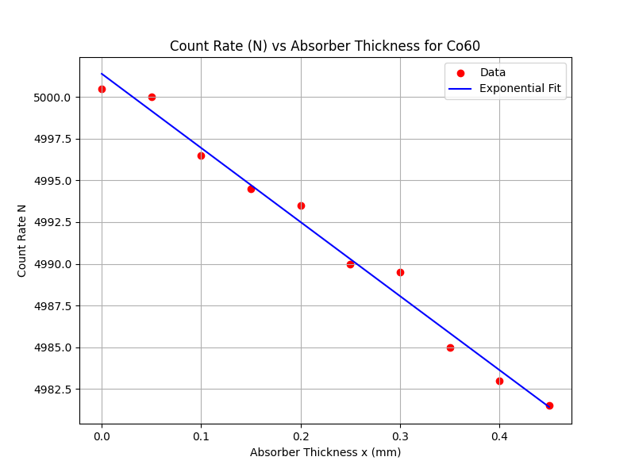

# Absorption of Beta and Gamma Radiation: A Comparative Simulation Study

**Author:** Daksh Pandey  
**Course:** PHT-106 (Charged Particles Spectroscopy)  
**College:** IIT Roorkee

## Project Overview
This project documents the development of a Geant4 simulation to study the absorption of radiation in matter. The study evolved from a basic setup that highlighted the limitations of thin absorbers for gamma radiation to an enhanced model that accurately captures the physics of beta spectra and high-Z attenuation.

---

## Phase 1: Initial Approach (v1)
### Setup
- **Absorber:** Aluminum (0.05 mm to 0.45 mm) for all sources.
- **Sources:** Mono-energetic particles (1.0 MeV).

### Observations & Inferences
- **Gamma Sources (Ra, Cs, Co):** The plots showed a **linear appearance**. Because Aluminum is highly transparent to these gammas at sub-millimeter scales, the exponential decay $e^{-\mu x}$ behaves linearly ($1 - \mu x$) over such a short range.
- **Beta Source (Sr-90):** Showed a clear **exponential appearance** even in thin Aluminum, as beta particles interact much more strongly with matter than photons.

| Sr-90 (v1 - Exponential appearance) | Cs-137 (v1 - Linear appearance) |
| :---: | :---: |
|  |  |

*Full v1 results are available in `v1_initial/data/v1_results.txt`.*

---

## Phase 2: Enhanced Experiment (Final Results)
### Setup Improvements
- **Beta Spectrum:** Replaced the mono-energetic Sr-90 with a continuous Y-90 beta spectrum ($E_{max}=2.28$ MeV).
- **High-Z Absorber:** Switched to **Lead (Pb)** for Gamma sources and increased thickness to 30 mm to observe true exponential curvature.
- **Custom Ranges:** Tailored thickness ranges for each source to capture the most relevant data points.

### Final Results Summary

| Source | Material | $\mu$ (mm$^{-1}$) | Physics Insight |
| :--- | :--- | :--- | :--- |
| **Sr-90** | Aluminum | 1.0529 | Beta spectrum reveals complex range-energy relationship. |
| **Cs-137** | Lead | 0.1203 | Clear exponential decay observed in high-Z material. |
| **Ra-226** | Lead | 0.0779 | High penetration energy confirmed. |
| **Co-60** | Lead | 0.0642 | Lowest $\mu$ matches the highest incident photon energy. |

---

## Graphical Analysis (Final)

### GM Plateau Curve
The detector's response plateau was established to ensure stable counting during the experiment.

### Beta Absorption (Sr-90 in Aluminum)
The spectrum-based simulation shows the characteristic "tail" as higher-energy betas penetrate deeper into the 5 mm Aluminum stack.

### Gamma Absorption (Cs-137 & Co-60 in Lead)
Using Lead allows us to see the actual "bend" in the exponential curve, providing a much more accurate fit for the absorption coefficient.
| Cs-137 (662 keV) | Co-60 (1.25 MeV) |
| :---: | :---: |
|  |  |

---

## Final Inferences
1. **Material Sensitivity:** Gamma rays require high-$Z$ absorbers (like Lead) and significant thickness to exhibit measurable attenuation.
2. **Energy Dependence:** There is a clear inverse relationship between particle energy and the linear absorption coefficient.
3. **Beta vs. Gamma:** Charged particles (betas) lose energy significantly faster than uncharged photons (gammas) due to continuous Coulomb interactions.

## Project Structure
- `src/` & `include/`: Current Geant4 source code.
- `results/`: Final data and plots (Lead absorbers, Beta spectrum).
- `v1_initial/`: Replication of the first attempt (Aluminum only, mono-energetic).
- `run_experiment.py`: Main runner for the final experiment.
- `v1_initial/run_v1.py`: Runner for the initial approach.

