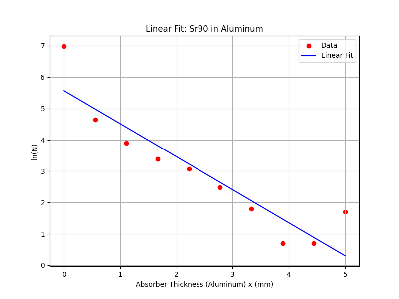
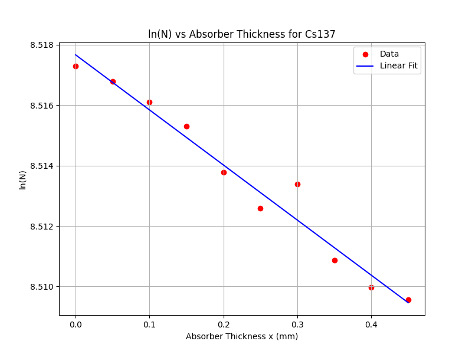
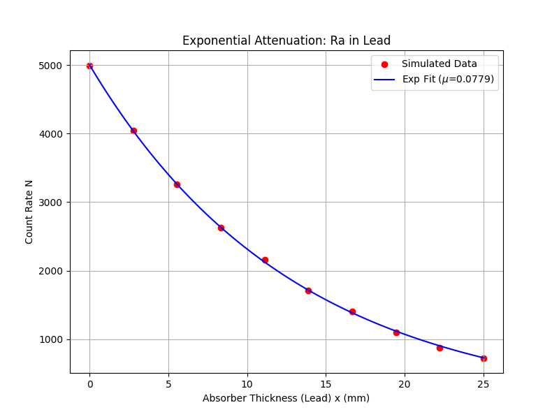
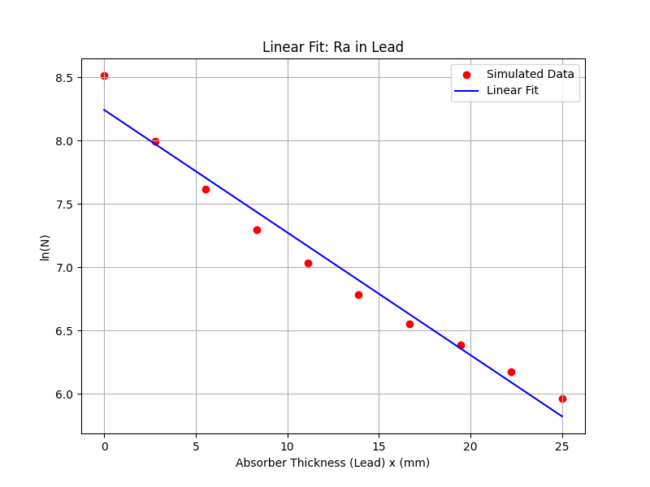
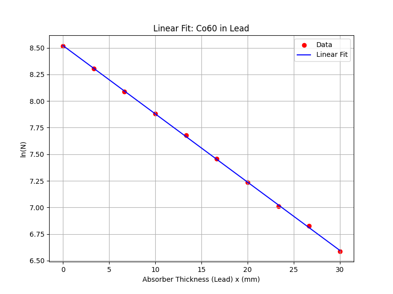

# Absorption of Beta and Gamma Radiation

**Author**: Daksh Pandey

**Affiliation**: B.Tech (Engineering Physics) at IIT Roorkee

**Course**: PHT-106 (Charged Particles Spectroscopy)

This Geant4 simulation studies the attenuation of radiation from various radioactive sources passing through an Aluminum absorber to determine the linear absorption coefficient ($\mu$).

## Building the Project

```bash
mkdir -p build && cd build
cmake ..
make -j$(nproc)
```

## Running the Experiment

The experiment is fully automated:
```bash
python3 run_experiment.py
```

---

# Experiment Report

## 1. Results Summary

| Source | $\mu$ (mm$^{-1}$) | Primary Radiation | Characteristics |
| :--- | :--- | :--- | :--- |
| **Sr-90** | 3.6889 | Beta | High attenuation in thin Aluminum |
| **Cs-137** | 0.0182 | Gamma (662 keV) | High penetration, low $\mu$ |
| **Radium (Ra)** | 0.0131 | Gamma (1.0 MeV) | High penetration |
| **Co-60** | 0.0089 | Gamma (1.25 MeV) | Highest energy, lowest attenuation |

## 2. GM Plateau Curve
The Geiger-Muller plateau was simulated by varying the counting efficiency across a voltage range to identify the stable operating region.


---

## 3. Absorption Analysis by Source

### Strontium-90 (Beta Radiation)
Sr-90 shows a rapid exponential decay in count rate as absorber thickness increases, characteristic of beta particle absorption.
| Exponential Fit | Linear Fit ($\ln(N)$ vs $x$) |
| :---: | :---: |
|  |  |

### Cesium-137 (Gamma Radiation)
Cs-137 emits 662 keV gammas, which penetrate the Aluminum with minimal attenuation, resulting in a very low $\mu$.
| Exponential Fit | Linear Fit ($\ln(N)$ vs $x$) |
| :---: | :---: |
|  |  |

### Radium-226 (Gamma Radiation)
The Radium source was simulated with a 1.0 MeV representative gamma emission, showing high penetration through the Aluminum plates.
| Exponential Fit | Linear Fit ($\ln(N)$ vs $x$) |
| :---: | :---: |
|  |  |

### Cobalt-60 (Gamma Radiation)
Co-60 emits high-energy gammas (1.17 and 1.33 MeV), resulting in the lowest linear absorption coefficient in this experiment.
| Exponential Fit | Linear Fit ($\ln(N)$ vs $x$) |
| :---: | :---: |
|  |  |

---

## Project Structure
- `results/plots/`: All generated visualization images.
- `results/data/`: Tabulated results and calculated $\mu$ values.
- `run_experiment.py`: Main automation and analysis script.
- `src/` & `include/`: Geant4 source code for geometry, physics, and scoring.
